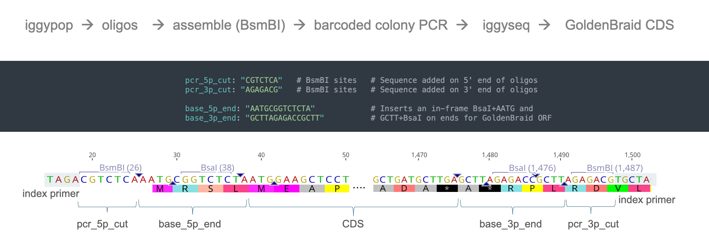
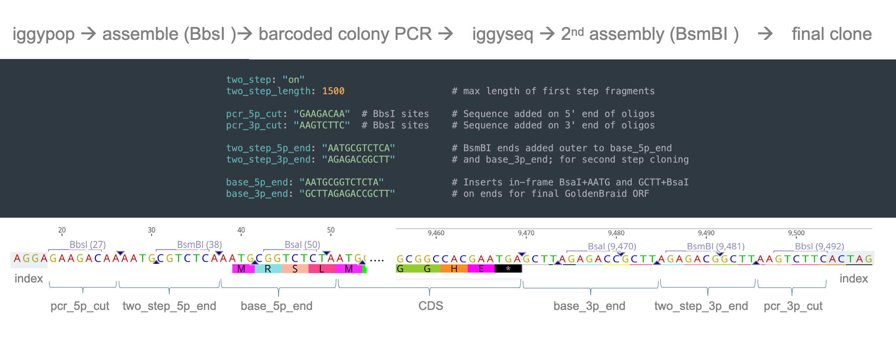

# iggypop


**iggypop** is a pipeline for designing and synthesizing genes from oligonucleotide pools. Input sequences are fragmented into segments that can be amplified using gene-specific primers and reassembled by Golden Gate cloning. Sequence-verified constructs are then identified by nanopore sequencing of barcoded amplicons using [IGGYPOPseq](https://github.com/ZenanXing/Construct-Validation-for-IGGYPOPseq).

## Installation

### Linux
```bash
git clone https://github.com/cutlersr/iggypop
cd iggypop
conda create -n iggypop python=3.9 r-base=4.3.3 -c conda-forge
conda activate iggypop
chmod +x setup.sh
./setup.sh
```

### Docker
```bash
# this is your best option on a mac
git clone https://github.com/cutlersr/iggypop
cd iggypop
docker build -t iggypop .
chmod +x setup.sh
./setup.sh
docker run -it -v $(pwd):/app iggypop
```

## Working with Coding Sequences
Coding sequences are domesticated, fragmented, indexed, and appended with cut sites to yield oligonucleotides that can be amplified with gene-specific primers and then assembled using Golden Gate methods. Sequence domestication and optimization prior to fragmentation is conducted using the software package _dnachisel_; sequence optimization parameters can be set in a YAML file using _dnachisel_ [`specifications`](https://edinburgh-genome-foundry.github.io/DnaChisel/ref/builtin_specifications.html). Several YAML files used in our common workflows are in the  [YAML folder](yaml/).

To generate oligos using default settings:
```bash
./iggypop.py cds --i "test/10_TFs.fasta" --o "10_TFs"

# OUTPUTS:
# designed sequences, oligo pools, required indexing primers, logs: out/10_TFs
# changes made to input sequences: out/10_TFs/reports
# .gb file with sequences and annotated changes: out/10_TFs/10_TFs_all_reports.gb
# input files, yaml parameter file, code used: out/10_TFs/assets 
# amplicon sequencing template file: out/10_TFs/SampleInfo.tsv
```

The default settings (`yaml/domesticate_cds.yml`):

- Remove GG sites used for assembly and downstream MoClo (BsaI, BsmBI)
- Enforce synonymous changes
- Assemble from oligos ≤ 250 bp with BsmBI
- Create GoldenBraid / MoClo compatible ORFs

#### Sequence optimization using `dnachisel` functions:
```bash
# This yaml removes common IIS sites, codon optimizes using `match_codon_usage`
# and an rice codon table, remove hairpins, and reduces repeated sequences 
# ≥12 bp using `UniquifyAllKmers` optimization:
./iggypop.py cds                          \
--i "test/10_TFs.fasta" --o "10_TFs_mcu"  \
--yml "yaml/domesticate_cds_mcu.yml"      \
--species o_sativa
```

#### GC-boosting
This example used `dnachisel`functions to design assembly oligos for domesticated and GC-boosted versions of input coding sequences with the parameters used to design STARBURST in Dvir *et al.* 2025.
```bash
./iggypop.py cds --i "test/edibles.fasta" --o "high_gc_edibles"  \
				 --yml "yaml/domesticate_cds_mcu_gc_53.yml"                     
```

#### Overriding defaults:
The default parameters can be modified by creating new YAML files or using arguments on the command line.  For example, to modify from the command line so that the only additions to the sequence are 5'-AATG and GCTT-3', which are required as terminal overhangs with the pPOP vectors:
```bash
./iggypop.py cds                                        \
    --i "test/10_TFs.fasta" --o "10_TFs_not_moclo"      \
    --base_5p_end "AATG" --base_3p_end "GCTT" 
```

#### Changing cloning overhangs
You can change the external overhangs for cloning; all three parameters below need to be updated.
```bash
./iggypop.py cds --i "test/RUBY.fasta"          \
    --base_5p_end AAAA    --base_3p_end GCCG    \
    --ext_overhangs AAAA GCCG
```


#### Using different enzymes, oligo lengths, and codon optimization:
To codon optimize coding sequences with an *E. coli* codon table, use BsaI sites for assembly, and synthesize ≤300 bp oligonucleotides:
```bash
./iggypop.py cds                                               \
    --i "test/10_TFs.fasta" --o "10_TFs_300bp_BsaI_coli_mcu"   \
    --pcr_5p_cut "GGTCTCA" --pcr_3p_cut "AGAGACC"              \
    --codon_opt "match_codon_usage" --species "e_coli"         \
    --oligo_length 300
```


#### MoClo compatibility:
Iggypop's defaults are oriented toward developing reusable MoClo/Goldenbraid compatible genetic parts. The default `iggypop.py cds` settings create sequences with 5'-BsaI-AATG and GCTT-BsaI-3' ends. 


You can adjust the `base_5p_end` and `base_3p_end` parameters to modify this behavior.   

If you want to make minimal changes to your input sequence, use the minimal yaml; it removes the IIS site used for cloning into pPOP-BsmBI, appends the required cloning overhangs (AATG/GCTT) but makes no other changes:
```bash
./iggypop.py cds --i "test/10_TFs.fasta" --o "10_TFs"    \
                 --yml yaml/domesticate_cds_minimal.yml
```


#### Working with non-coding sequences:
`iggypop.py cds` checks to ensure that your sequence is an ORF (multiple of 3) that begins with an ATG; this is required so that only synonymous changes are made to your coding sequence when IIS sites are removed (required for proper assembly). If you want to generate oligos for non-coding sequences, such as promoters, you can use the `--require_orf off` flag. This example uses a yaml that will take an input fasta file and generate oligos to create constructs in pPOP with Goldenbraid compatible promoter fragments (BsaI--GGAG....AATG--BsaI);  BsmBI and BsaI are removed if present. 
```bash
./iggypop.py cds                                                     \
    --i "test/10_At_promoters.fasta" --o "10_At_promoters"           \
    --yml yaml/promoters.yml
```

For complex constructs containing coding and non-coding sequences, use `iggypop.py gb` and an annotated GenBank file (see below).


#### Two-step assemblies
Although assembly of long (>2.5 kb) sequences is possible, the assembly efficiency can be low and identifying error-free clones often requires more amplicon sequencing. For longer sequences, we recommend that you use the two-step assembly mode; this breaks sequences into "step one" blocks which are assembled from oligo pools using BbsI into the pPOP-BbsI vector. Sequence validated step one clones are identified and the final genes are assembled in a second step using pPOP-BsmBI.


To do this, use the provided `two_step` YAML files:
```bash
./iggypop.py cds --i "test/RUBY.fasta" --o "RUBY_two_step"   \
                --yml "yaml/domesticate_two_step_cds.yml"
```

Note: The two-step assembly YAMLs add BbsI sites (instead of BsmBI) to the oligo ends for assembly of the PCR products amplified from pools.


#### Combining oligo pools from different runs
Use "--primer_index" to specify the starting row of the indexset file for new runs.
```bash
./iggypop.py cds --i "test/edibles.fasta" --o "edibles"
./iggypop.py cds --i "test/juiceables.fasta" --o "juiceables" --primer_index 11
```

Then combine files into one fasta file to create an oligo pool file for ordering:
```bash
cat out/juiceables/juiceables_oligo_pool.fasta \
    out/edibles/edibles_oligo_pool.fasta > out/oligo_order.fasta
```

You can use `assemble_fragments.py` to simulate golden gate assembly and confirm that none of your index primers are used on more than one gene and output the assembled sequences to a fasta file:
```bash
python scripts/assemble_fragments.py --i "out/oligo_order.fasta"          \
                                     --o "out/assembled_ej_oligos.fasta"
```


#### Generating oligos without modifications to input sequences
`--mode no_mods` will run the hinging process (i.e. identify high-fidelity overhang sets) and output indexed oligo for input sequences without making any changes to your input sequences.


#### Sequence optimization only
`--mode no_hinge` will output only dnachisel'd sequences. This example domesticates a set of input sequences using `dnachisel`. This is a convenient way to access `dnachisel`'s large set of sequence optimization parameters through a yaml. 
```bash
./iggypop.py cds --i "test/edibles.fasta" --o "domesticated_edibles"  \
				 --yml "yaml/chisel_only.yml"                      
```


#### Improving predicted ligation fidelities
You may see marginal increases in predicted ligation fidelity by increasing the search `radius` around target cut sites and/or by increasing the number of solutions evaluated (`n_tries`). This is usually not worth tweaking unless your targets generate low fidelities (<95%) with the defaults and/or your assemblies use a large number of overhangs.
```bash
./iggypop.py cds --i "test/RUBY.fasta" --o "five_RUBYs"  \
				 --radius 10                             \
				 --n_tries 50                            
```


#### Changing the data used to calculate ligation fidelities
The default dataset used to predict ligation fidelity is taken from Potapov et al.'s supplemental data for ligations with BsaI & T4 DNA ligase at 25 ºC for 18 hrs (FileS03_T4_18h_25C.xlsx). Multiple fidelity data sets are in the data/ folder. To use their BsmBI/T4 fidelity data:
```bash
./iggypop.py cds --i "test/10_TFs.fasta" --o "10_TFs_BsmBI_data.fasta"  \
				--fidelity_data "data/BsmBI-HFv2_T4.xlsx"
```

#### Using Subramanian primers instead of indexsets:
This yaml uses the a 24 x 24 combinatorial set of Subramanian primers to allow for indexing 576 targets (see doi: 10.1093/synbio/ysx008). We have not experimentally tested these with our pipeline.
```bash
./iggypop.py cds                                                 \
    --i "test/35_At_cds.fasta" --o "35_At_cds_subra"             \
    --yml "yaml/domesticate_cds_subramanian_primers_576.yml" 

## you can also use this yaml for more targets or make your own sets
#   --yml "yaml/domesticate_cds_subramanian_primers_2304.yml" 
```

#### Reproducible runs
Set `--seed 123` to force a specific seed. The log files list the seeds used for each sequence.


## Working with GenBank Formatted Sequences
The parameters for optimizing GenBank files differ and use annotations added to your GenBank file using dnachisel's [`GenBank API`](https://edinburgh-genome-foundry.github.io/DnaChisel/genbank/genbank_api.html). `iggypop.py format` allows easy parameter setting in a YAML file:
```bash
# Format a GenBank file using the default domesticate_gb.yml file
./iggypop.py format --i "test/sfGFP_unformatted.gb" --o "test/sfGFP_formatted.gb"
```

Default settings:

- Remove cloning GG Sites (BsaI and BsmBI, using `@AvoidPattern` tags)
- Protect annotated regulatory sites with `@AvoidChanges` tags
- Enforce synonymous changes to annotated CDSs using `@EnforceTranslation` tags
- Assemble oligos ≤ 250 bp for BsmBI assembly using AATG/GCTT overhangs

Check the output in your favorite viewer, then generate your oligos:
```bash
./iggypop.py gb --i "test/sfGFP_formatted.gb" --o "sfGFP" 
```


## IGGYPOPseq
Our pipeline identifies error-free clones via nanopore sequencing of barcoded colony PCR amplicons. The amplicon barcoding primers for the pPOP and pPlant-POP vectors are in the data folder [here](data/amplicon_barcoding_primers.xlsx).  Six amplicons per target are typically generated by colony PCR; all amplicons for a given experiment are bead purified, library-prep'd and then sequenced on an ONT Minion flow cell. The fastq data from a run is then processed using our sequence analysis pipeline: [Construct-Validation-for-IGGYPOPseq](https://github.com/ZenanXing/Construct-Validation-for-IGGYPOPseq)


## Overhang selections using `hingesets`
iggypop uses *goldenhinges* to identify overhang solutions using precomputed high-fidelity `hingesets`, are passed as constraints to `goldenhinges`. The `hingesets`  were selected  using a genetic algorithm (`iggypop.py gagga`) and or Monte Carlo optimizers (`iggypop/gagga_MC.py`). The data below show the typical fidelities obtained for fragments created using a set of 4500 plant transcription factors with the final `hingesets.xlsx` set.


The `hingesets` were optimized for use with AATG/GCTT cloning overhangs.  If you'd like to make new hingesets optimized with other overhangs or fidelity datasets, you can use `gagga` to create new hingesets. For example with AATG/AATC cloning overhangs and the a BsaI/T4 fidelity dataset:
```bash
./iggypop.py gagga --set_size=20 --pop_size=1000          \
                   --min_improve=.0001 --alpha 2.4        \
                   --beta 2.4 --tournament_size 4         \
                   --fixed_overhangs AATG AATC            \
                   --potapov_data data/BsaI-HFv2_T4.xlsx
```


You can also use the existing hingesets as seeds for the GA runs which can help get to useful solution sets faster. 
```bash
./iggypop.py gagga --set_size=20 --pop_size=1000          \
                   --min_improve=.0001 --alpha 2.4        \
                   --beta 2.4 --tournament_size 4         \
                   --fixed_overhangs AATG AATC            \
                   --potapov_data data/BsaI-HFv2_T4.xlsx  \
                   --use_hingesets                 
```

To generate our final hingesets, we selected a maximally diverse set of high-fidelity hinges from 1000s of runs using `process_gagga_runs.R`:
```bash
Rscript scripts/process_gagga_runs.R --top_percent=2 --n_cliques=20 \
                                     --fidelity=BsaI-HFv2_T4.xlsx   \
```


## Gene-specific indexing primers -- indexsets
Our primers used for amplifying fragments from pools (`data/indexsets.csv`) are 18-mers with ~60 ºC Tm selected to minimize cross-hybridization between members or common lab contaminants (*E. coli*, T7, etc.). ~350 of the primer sets have been experimentally validated. We have reused these primers for several projects (i.e. they only need to be synthesized once). If you want to design your own primers with different parameters; use this pipeline:

```bash
./iggypop.py primers                   \
    --num_sequences 10 --opt_tm 60     \
    --opt_size 18 --gc_content 0.5     \
    --max_size 18 --min_size 18
```

The pipeline begins by generating random DNA sequences (excluding specified restriction sites) with defined length and GC content. Primer3 is then used to design PCR primer pairs for these sequences at preset sizes and melting temperatures. Next, MFEprimer is employed to screen the candidates—first filtering out primer pairs with high off‑target (cross‑binding) scores using a cutoff (by default, retaining the best 30% of candidates) and then removing those predicted to generate off‑target amplicons or to cross‑hybridize with contaminants (using a secondary cutoff that retains roughly the best 50% of the first filter).  The final primer pairs—characterized by minimal cross binding (non‑specific interactions) and no predicted off‑target amplicon formation—are then output for downstream applications.